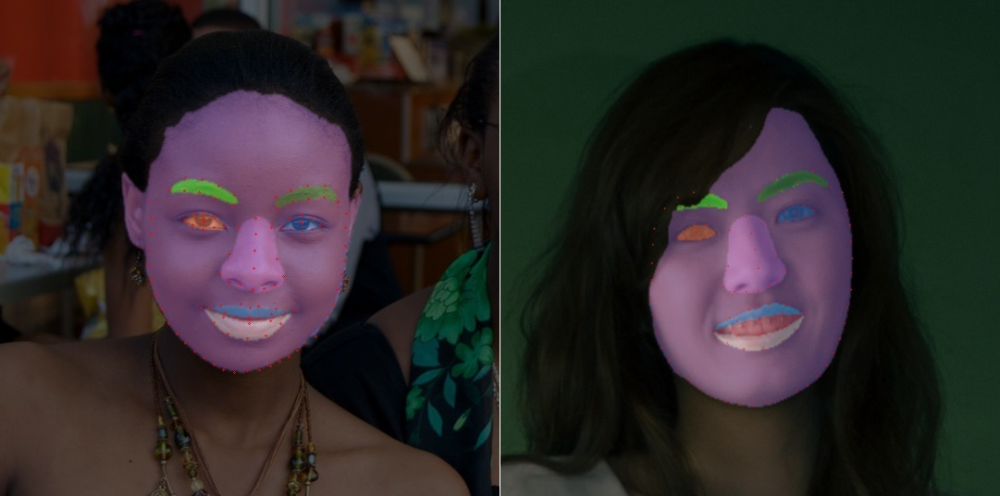

# FPLNet
FPLNet : Face Parsing and Landmarks with Cascaded ConvNets




## Summary

This repository contains the <b>FPLNet</b> models, a facial landmarks and face parsing estimator. It also contains source code to run the inference on the model and provide a test tool to showcase its abilities.

## How it works

The processing pipeline consists of two principal steps :
1. Detect faces in an image or video frame
2. Infer with FPLNet the landmarks and face parsing segmentation for each detected face

The models can be easily deployed in third-party projects by adding a few lines of code. Check the test.py file for an example.

## Getting started
### Installing

1. Create a virtual environment (python >= 3.9).

2. Clone the repository
```bash
git clone https://github.com/MSch8791/FPLNet.git
```

3. Install the dependencies with pip
```bash
pip install -r requirements.txt
```

4. The trained models are provided in the `models` directory. Download them with Git LFS
```bash
git lfs pull
```

5. Test using the test script
```bash
cd src/
python test.py --image=../test/test_image.jpg --output=../test/test_output.jpg
```

## Performances

Model name | Test dataset | Landmarks NME<sub>inter-eye</sub> | Landmarks RMSE | Parsing F1-score |
:---: | :---: | :---: | :---: | :---: |
fplnet_256_LaPa_4c_20240516 | LaPa test | 0.02132 (2.13%) | 2.5659 | TO DO |

## BibTeX Citation

Please consider citing this project in your publications if it helps your research or projects. BibTeX reference is as follows.
```
@misc{Scherer_FPLNet_Face_2024,
    author       = {Scherer, Michael},
    title        = {FPLNet : Face Parsing and Landmarks with Cascaded ConvNets},
    month        = {January},
    year         = {2024},
    publisher    = {GitHub},
    journal      = {GitHub repository},
    howpublished = {\url{https://github.com/MSch8791/FPLNet}}
    doi          = {10.5281/zenodo.13715936}
}
```

## Acknowledgments

The <b>FPLNet</b> model has been trained on the LaPa train dataset available here : https://github.com/jd-opensource/lapa-dataset

The face detector model used in the demo/test script is [YuNet](https://github.com/ShiqiYu/libfacedetection) through [OpenCV](https://github.com/opencv).
